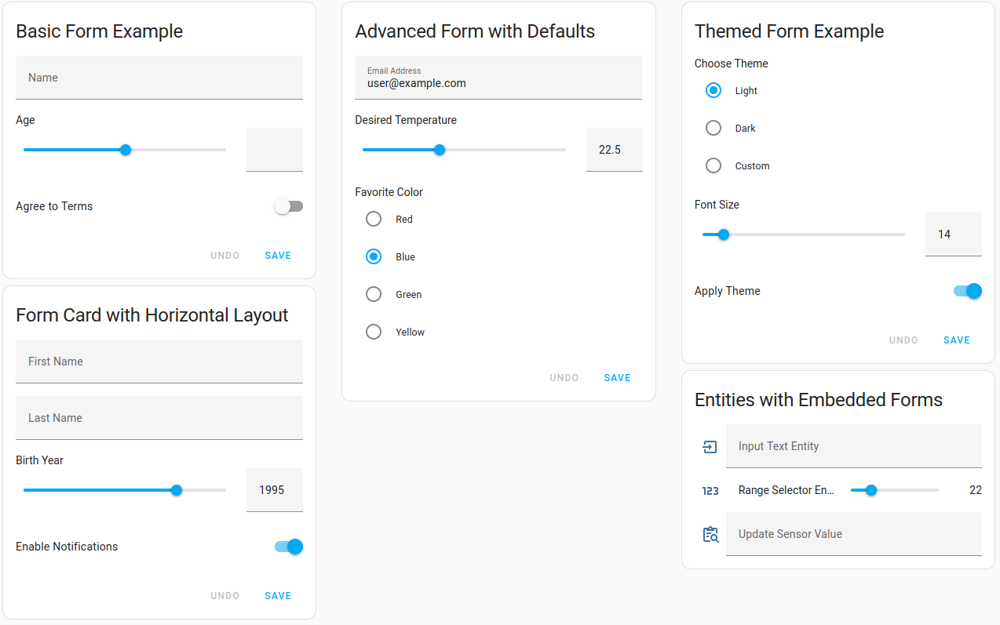
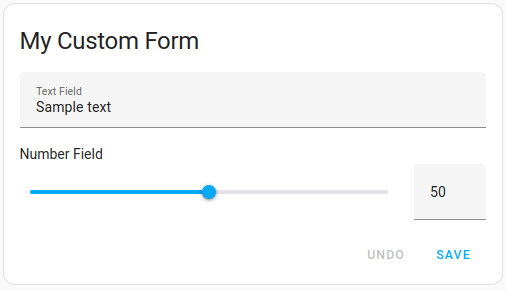
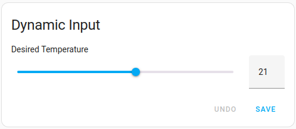
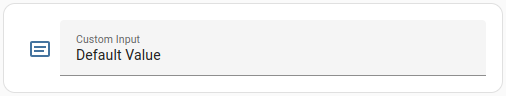

# 📝 Form Card

[![hacs][hacs-badge]][hacs-url]
[![release][release-badge]][release-url]
[![License][license-badge]](LICENSE)
![downloads][downloads-badge]
![build][build-badge]
![Made with Love in Norway][madewithlove-badge]

<a href="https://www.buymeacoffee.com/bendikrb" target="_blank"></a>



A powerful custom Home Assistant Lovelace card designed to create dynamic forms and handle form-based actions with ease.

Form Card enables you to integrate highly customizable forms into your dashboards, using Home Assistant-provided selectors. Pair it with `form-entity-row` to embed form fields inside entity rows for seamless user experiences.

---

## Features

- **Dynamic Form Field Support**: Build forms with various input types using [Home Assistant selectors][home-assistant-selector-docs].
- **Action Triggers**: Perform actions when forms are submitted or values are changed.
- **Data Management**: Spread values directly into action payloads or nest them under a key for structured data.
- **Templating**: Utilize Jinja2 templates in field names, values, or action data for configurable dynamic behavior.
- **Entity Row Integration**: Add form fields directly to entity rows with `form-entity-row`.

---

## Installation

### HACS

form-card is available in [HACS][hacs] (Home Assistant Community Store).

Use this link to directly go to the repository in HACS

[](https://my.home-assistant.io/redirect/hacs_repository/?owner=bendikrb&repository=lovelace-form-card)

_or_

1. Install HACS if you don't have it already
2. Open HACS in Home Assistant
3. Search for "Mushroom"
4. Click the download button. ⬇️


### Manual

1. Download `form-card.js` file from the [latest release][release-url].
2. Put `form-card.js` file into your `config/www` folder.
3. Add reference to `form-card.js` in Dashboard. There's two way to do that:
  - **Using UI:** _Settings_ → _Dashboards_ → _More Options icon_ → _Resources_ → _Add Resource_ → Set _Url_ as `/local/form-card.js` → Set _Resource type_ as `JavaScript Module`.
    **Note:** If you do not see the Resources menu, you will need to enable _Advanced Mode_ in your _User Profile_
  - **Using YAML:** Add following code to `lovelace` section.
      ```yaml
      resources:
          - url: /local/form-card.js
            type: module
      ```

---

## Configuration

### Basic Example



<details><summary>YAML:</summary>

```yaml
type: custom:form-card
title: My Custom Form
fields:
  - name: text_field
    label: Text Field
    entity: input_text.my_text
    selector:
      text: { }
  - name: number_field
    label: Number Field
    selector:
      number:
        min: 0
        max: 100
        step: 1
    default: "50"
save_action:
  action: call-service
  service: input_text.set_value
  target:
    entity_id: input_text.my_text
  data:
    value: "{{ value['number_field'] }}"
```
</details>

---

### Options

| Parameter               | Type      | Default | Required? | Description                                                                          |
|-------------------------|-----------|---------|-----------|--------------------------------------------------------------------------------------|
| `type`                  | `string`  | N/A     | ✅         | Must be set to `custom:form-card`.                                                   |
| `title`                 | `string`  | N/A     | ❌         | Title of the form card.                                                              |
| `fields`                | `array`   | N/A     | ✅         | Array defining form fields (see [`field options`](#field-options) below).            |
| `reset_on_submit`       | `boolean` | `false` | ❌         | If `true`, resets the form on submit.                                                |
| `spread_values_to_data` | `boolean` | `false` | ❌         | If `true`, spreads form values into action payload directly.                         |
| `save_action`           | `action`  | N/A     | ❌         | Defines what [action][home-assistant-action-docs] occurs when the form is submitted. |


### Entity row options

| Parameter               | Type       | Default        | Required? | Description                                                                                |
|-------------------------|------------|----------------|-----------|--------------------------------------------------------------------------------------------|
| `type`                  | `string`   | N/A            | ✅         | Must be set to `custom:form-entity-row`.                                                   |
| `selector`              | `selector` | N/A            | ✅         | [Selector][home-assistant-selector-docs] configuration.                                    |
| `entity`                | `string`   | N/A            | ❌         | Entity ID for the field.                                                                   |
| `label`                 | `string`   | N/A            | ❌         | Display name for the field.                                                                |
| `default`               | `any`      | `entity` state | ❌         | Default value for the field. Will be set to `entity` (if specified) state if not provided. |
| `icon`                  | `string`   | N/A            | ❌         | Icon for the field.                                                                        | 
| `spread_values_to_data` | `boolean`  | `false`        | ❌         | If `true`, spreads form values into action payload directly (under the key `value`).       |
| `change_action`         | `action`   | N/A            | ❌         | Defines what [action][home-assistant-action-docs] occurs when the field is changed.        |

If `entity` is provided, it will be used as the default value for `target` in your `change_action`.


#### Field Options

Each element in the `fields` array supports the following options:

| Parameter     | Type       | Default        | Required? | Description                                                                                |
|---------------|------------|----------------|-----------|--------------------------------------------------------------------------------------------|
| `name`        | `string`   | N/A            | ✅         | Unique identifier for the field.                                                           |
| `label`       | `string`   | N/A            | ❌         | Display name for the field.                                                                |
| `entity`      | `string`   | N/A            | ❌         | Entity ID for the field.                                                                   |
| `selector`    | `selector` | N/A            | ✅         | [Selector][home-assistant-selector-docs] configuration.                                    |
| `default`     | `any`      | `entity` state | ❌         | Default value for the field. Will be set to `entity` (if specified) state if not provided. |
| `description` | `string`   | N/A            | ❌         | Description for the field.                                                                 |
| `placeholder` | `string`   | N/A            | ❌         | Placeholder text for the field.                                                            |
| `required`    | `boolean`  | `false`        | ❌         | Marks the field as required.                                                               |
| `disabled`    | `boolean`  | `false`        | ❌         | Whether the field is disabled.                                                             |


All options accept [jinja2 templates][home-assistant-template-docs].

The templates have access to a few special variables. Those are:

  - `config` - an object containing the card configuration
  - `user` - the username of the currently logged in user

For entity rows and fields with `entity` specified, the following variables are also available:
  - `entity` - the entity ID of the field


---

## Examples

### Dynamic Field Values Example



<details><summary>YAML:</summary>

```yaml
type: custom:form-card
title: Dynamic Input
fields:
  - name: temperature
    label: Desired Temperature
    entity: climate.living_room
    selector:
      number:
        min: 10
        max: 30
        step: 1
    default: "{{ state_attr(entity, 'temperature') }}"
save_action:
  action: call-service
  service: climate.set_temperature
  target:
    entity_id: climate.living_room
  data:
    temperature: "{{ value['temperature'] }}"
```
</details>

---

### Embedded Entity Row Example



<details><summary>YAML:</summary>

```yaml
type: entities
entities:
  - type: custom:form-entity-row
    entity: input_text.my_text
    label: Custom Input
    default: "Default Value"
    change_action:
      action: call-service
      service: input_text.set_value
      data:
        value: "{{ value }}"
# or (equivalent):
    spread_values_to_data: true
    change_action:
      action: call-service
      service: input_text.set_value
```
</details>


---
<!-- Badges -->

[hacs-url]: https://github.com/hacs/integration
[hacs-badge]: https://img.shields.io/badge/hacs-default-orange.svg?style=flat-square
[release-badge]: https://img.shields.io/github/v/release/bendikrb/lovelace-form-card?style=flat-square
[downloads-badge]: https://img.shields.io/github/downloads/bendikrb/lovelace-form-card/total?style=flat-square
[build-badge]: https://img.shields.io/github/actions/workflow/status/bendikrb/lovelace-form-card/release.yaml?branch=master&style=flat-square
[license-badge]: https://img.shields.io/github/license/bendikrb/lovelace-form-card.svg?style=flat
[madewithlove-badge]: https://madewithlove.now.sh/no?heart=true&colorB=%233584e4

<!-- References -->

[home-assistant]: https://www.home-assistant.io/
[home-assistant-selector-docs]: https://www.home-assistant.io/docs/blueprint/selectors
[home-assistant-action-docs]: https://www.home-assistant.io/dashboards/actions
[home-assistant-template-docs]: https://www.home-assistant.io/docs/configuration/templating
[hacs]: https://hacs.xyz
[release-url]: https://github.com/bendikrb/lovelace-form-card/releases
